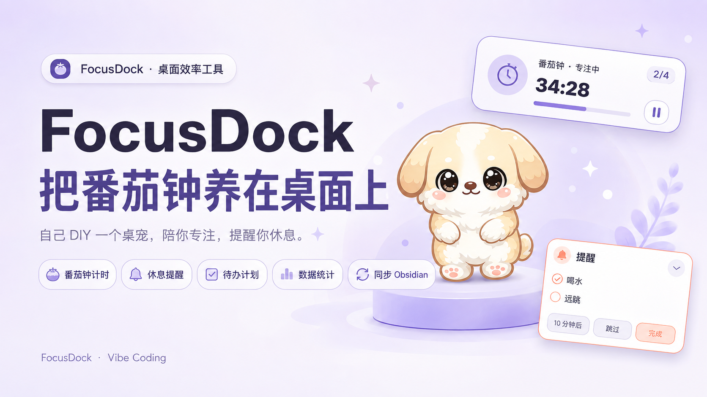

# FocusDock DIY



FocusDock 是一个“桌宠 + 番茄钟 + 节律提醒”实验项目。这个仓库不是一个所有平台下载即用的成熟产品，而是一个可运行、可拆解、可交给 Agent 继续改造的 Vibe Coding 参考案例。

> 不必复制我的番茄钟。复制这套方法，做一个真正属于你的桌宠。

## 它是什么

- 原生 macOS SwiftUI 应用：番茄钟、休息流程、今日计划、节律提醒、菜单栏和桌面宠物。
- DIY Starter Kit：需求模板、Agent 对话模板、角色设定表、动作清单、验收和发布检查表。

FocusDock 曾有过早期 Web 实验，但它不包含原生桌面版的悬浮窗口和桌宠体验，也不是作者实际使用的版本，因此不再放入本公开仓库。

## 先看兼容性

| 你的环境 | 现在能做什么 |
| --- | --- |
| macOS 14+ | 可以下载源码并自行构建原生版 |
| Apple Silicon Mac | 当前主要开发和验证环境 |
| Intel Mac | 需要自行生成兼容的构建产物 |
| Windows / Linux | 不能直接运行这份 SwiftUI `.app` |
| 想做 Windows 桌宠 | 可以以需求和交互为参考，让 Agent 用 Tauri、Electron 或 WinUI 重新实现 |

### 关于直接下载 `.app`

仓库暂不提供经 Apple Developer ID 签名和公证的正式发行包。普通用户不应把本仓库当作一个“下载后直接拖入应用程序”的发行页。如果你只想学习或 DIY，按下面的步骤从源码构建即可。

## 快速开始

### macOS 原生版

需要：

- macOS 14 或更高
- Xcode Command Line Tools
- Swift 6 工具链

```bash
xcode-select --install
cd FocusDockMac
swift test
Scripts/build-app.sh
open dist/FocusDock.app
```

也可以在仓库根目录使用统一脚本：

```bash
./script/build_and_run.sh --verify
```

Codex Desktop 用户可以直接使用仓库中的 `.codex/environments/environment.toml` Run 动作。

## 用 Agent 做自己的版本

从 [DIY Starter Kit](DIY-STARTER-KIT/README.md) 开始。推荐流程：

1. 用 [Idea Brief](DIY-STARTER-KIT/01-idea-brief.md) 说清楚你想解决的问题。
2. 用 [Agent 对话模板](DIY-STARTER-KIT/02-agent-conversation.md) 让 Agent 先规划，再改代码。
3. 用 [角色设定表](DIY-STARTER-KIT/03-character-bible.md) 创造你的桌宠。
4. 按 [动作清单](DIY-STARTER-KIT/04-action-list.md) 生成一致的角色素材。
5. 每轮修改后用 [验收清单](DIY-STARTER-KIT/05-acceptance-checklist.md) 检查。
6. 遇到问题时按 [Bug 反馈模板](DIY-STARTER-KIT/06-debug-feedback.md) 描述，不要只说“不好看”。
7. 公开分享前执行 [发布检查](DIY-STARTER-KIT/07-publishing-checklist.md)。

也可以直接把 [AGENT_START_HERE.md](AGENT_START_HERE.md) 交给你的 coding agent。

## 数据和隐私

- macOS 版的个人状态保存在本机。
- Obsidian 联动是可选功能，使用者自行选择本地路径。
- 仓库不包含作者的个人计划、应用状态、Obsidian 库、本机路径或私人 Agent 记录。

更多信息见 [PRIVACY.md](PRIVACY.md)。

## 仓库结构

```text
FocusDockMac/          macOS SwiftUI 应用
DIY-STARTER-KIT/       用 Agent 复刻方法的模板
docs/assets/           README 与教程的公开图片
script/                统一 macOS 构建/运行入口
```

## 这个仓库不是什么

- 不是 App Store 上架包。
- 不是已签名公证的 macOS 正式发行包。
- 不是现成的 Windows 桌宠程序。
- 不是“一键换图就能发布”的无代码模板。

它是一个真实产品的可运行参考，适合拆解、提问、实验和继续创造。

## 许可证

代码和仓库中的示例素材按 [MIT License](LICENSE) 分享。如果你要发布自己的产品，建议替换为自己创作且有权使用的角色、图标、声音和品牌。见 [ASSETS.md](ASSETS.md)。
